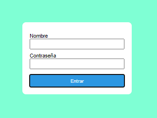

# Página de login



Nos han pedido que trabajemos en el desarrollo de la página de login de nuestra aplicación y para ello el maquetador ya ha preparado la estructura y el diseño de la vista.
En ella nos encontramos dos campos de formulario un input para **usuario** y uno para **contraseña**.

Nosotros tenemos guardados en nuestro server un **objeto** con los datos del usuario:

```js
//Datos de usuario
const userInfo = {
  name: "front23",
  password: "bicicleta",
};

//Número de intentos
let attemps = 0;
```

## Misión: es hacer que el login funcione con la siguiente lógica:

Si al hacer click en ENTRAR los valores de cada uno de los elementos del formulario son iguales que los valores guardados en el objeto de mi usuario, mostraré un alert que diga 'Estás dentro', en otro caso, incrementaré en 1 el valor de la variable attemps que contabiliza el número de intentos del usuario y mostraré un div que tengo oculto con el mensaje 'Alguno de los campos no es correcto'.


Si el usuario supera los 3 intentos aparecerá un mensaje de alert que diga estás bloqueado.


NOTA: Para mostrar estos mensajes utilizamos alert('Estás dentro/bloqueado') que nos muestra un modal del navegador.

